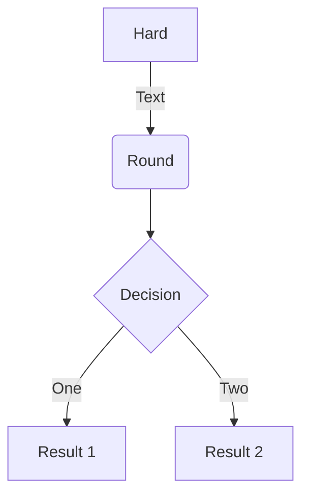

This is my personal blog.

Mainly about technology learning and thinking, but not limited to this.

Insist on originality, Update aperiodically.

<!-- more -->

## Code

```java
// Java
class HelloWorld {

    public static void main() {
        System.out.println("Hello World!");
    }
}
```

```c
// C
#include "stdio.h"

int main() {
    printf("Hello World!\n");
    return 0;
}
```

## Equation

$$
E = mc^2
$$

## Diagram



## Image



## Note

 Hello World! 

 Hello World! 

 Hello World! 

 Hello World! 

 Hello World! 

 Hello World! 
